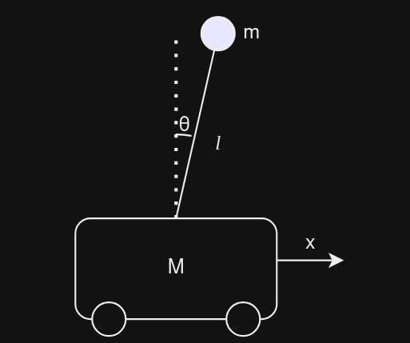
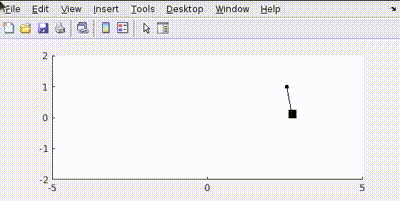
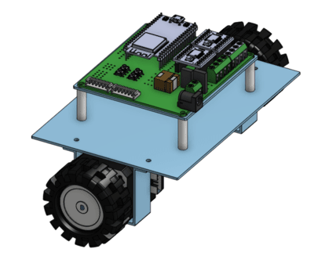

## About the Project
Our aim is to design a two-wheeled balancer, and program a self-balancing robot that uses LQR control to maintain its upright position. The project integrates concepts from linear algebra, state space equations, Lagrangian mechanics, and control theory, along with  3D modeling, MATLAB simulations, and stepper motor control with ESP-IDF. 

## Lagrangian Mechanics
Instead of focusing on forces and Newton’s laws, Lagrangian mechanics uses the Lagrangian function, ${L}$, which is the difference between the kinetic energy $T$ and potential energy $V$ of a system:
 
    $$\qquad \qquad L=T-V $$

The Lagrangian approach is better because we don't need to know the forces but just the constraints and we can straightforwardly use any type of coordinates we want as long as they describe the system.
Equations of motion are obtained by using 
 
 
$$\qquad \qquad \frac{d}{dt}\left(\frac{\partial L}{\partial \dot{q}_i}\right)-\frac{\partial L}{\partial q_i} =0 $$

## Control System
Control means to regulate or direct. Thus, a control system is the interconnection of various physical elements connected in a way to regulate or direct itself or the other system.
### State Space System
A system to be controlled is described as 
 
$$\qquad \qquad\dot{x}=Ax+Bu$$ 
 

Where $x=$ state variables, $\dot{x}=$ rate of change of state variables, $u$ is the input by actuator, matrix $A$ describes how the state variables interact and $B$ describes how inputs $u$ affect the state.
 
$$\qquad \qquad y=Cx+Du$$
 

$y$ is the output vector, $C$ is a matrix that maps the state variables to the outputs, and $D$ describes how the inputs directly affect the outputs.
 
This representation allows us to model and analyze the system.

### LQR control
Now we know how to represent a system to be controlled. LQR stands for Linear Quadratic Control, as the name suggests it tries to minimize the quadratic cost function of a linear system.
Here, 
 
$$\qquad \qquad J=\displaystyle \int_{0}^{ \infty } (x^TQx+u^TRu) dt$$ 
 
 
is our cost function. Where, $Q$ positive matrix that penalizes state error, and $R$ penalizes control effort. 
 
Optimal control effort is obtained by using $$u=-Kx$$ For that $K$ is the gain matrix given by $R^{-1}B^TP$ and $P$ is solution of Algebraic Riccati equation 
 
 
$$\qquad \qquad A^TP+PA-PBR^{-1}B^TP+Q=0$$
 
  Uff, enough maths let's get to implementaion.

## Implementation in MATLAB
Let's try to model an inverse pendulum on a cart using LQR control  

Using Lagrangian the equations obtained is -> 
 
 
$$\qquad \qquad L=\frac{1}{2}\dot{x}^2(M+m)+\frac{1}{2}m( l^2\dot{\theta}^2+2l\dot{x}\dot{\theta}cos(\theta) ) $$
 
 
Note that these equations are Non-Linear, to linearize them we must consider an equilibrium point(be it a stable or unstable). Supposing that point to be when $x=0$ and $\theta=0$. By applying Euler Lagrange equation, 
 
 
$$\qquad \qquad \displaylines{ (M+m)\ddot{x}+ml\ddot{\theta}=u \\  l\ddot{\theta} + \ddot{x}-g\theta=0}$$
 
 
As a proud engineer, we should consider approximations such as $cos\theta$ ->$1$ and $sin\theta$ ->$\theta$.
 
Now we can model this system in MATLAB. For that $A$ matrix in state space equation is our jacobian matrix w.r.t state variables and $B$ matrix is jacobian matrix w.r.t actuator variables.

#### My state variables here are $[x \quad \theta  \quad \dot{x} \quad \dot{\theta}]$ , initial position being $x=2$ , rest are zero and final position is $x=-2$.

Hence, the cart tries to adjust itself such that it achieves the final position of x=-2 with balancing the pendulum.

  

Putting all this in MATLAB and simulating gives us such controlled output

 

The pendulum achieves a rest state at given position.
### Relation of $Q$ and $R$
As we saw earlier LQR tries to minimize the cost function consisting of $Q$ and $R$ matrices.
#### $Q$ penalizes state error what does that mean?
Let's take a base case of a simple pendulum with Q matrix defined as Q=[100 0; 0 100] and R as 0.001 and we have to achieve an end point of $-\pi/2$ from rest.
  
For a pendulum it's state variables are defined by it's angle $\theta$ and $\dot{\theta}$ ,Q=[100 0; 0 100] says that we have given equal penalty to both error in position and velocity(Here in terms of $\theta$).
 
In simulation is obtained as 
 

 
#### Now let's penalize error in position more Q=[100 0; 0 1]
 

This happens because the control tries to minimize the error in position faster than velocity

 
#### Let's penalize actuator effort R=1
 

 
See how the actuator aims to use least amount of effort to conserve energy.
 

#### Increasing Q makes the system more focused on reducing state deviations, leading to more aggressive actions to keep the states closer to their desired values.
#### Increasing R makes the system prioritize minimizing control effort, resulting in more conservative actions and allowing larger state deviations.

In practical robotics, balancing actuator effort and energy is crucial to ensure efficiency and performance. Efficient control conserves energy, which is essential for battery-powered robots and helps extend their operational time. Such control also helps us setting the limits of a system.

## 3D Model and specifications
We created a 3D model of our balancer using Onshape. 
For control we plan to use NEMA17 stepper motors for precision control along wiht A2988 motor driver.
Using ESP32-WROOM we plan to launch our model to control it.

This CAD-Model is to be simulated in MATLAB.

## Updates
- Completed understanding basics of Control Systems and LQR
- Successfully simulated control of Pendulum, Spring mass system and Inverse Pendulum
- Finished CAD-Model for balancer

## Challenges
- Problems in achiveing stepper control in ESP-IDF
- Setting up state space matrices
- Setting up the mathematical model for the CAD-Model and simulating it in MATLAB

## Future Plans
- Achieve simulation of CAD-Model in MATLAB
- Run our control on ESP32 with ESP-IDF framework

 